# Sample & Reference Diagrams

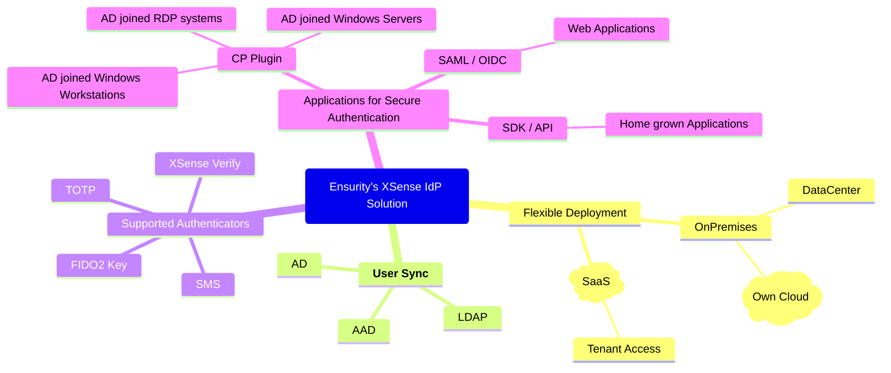

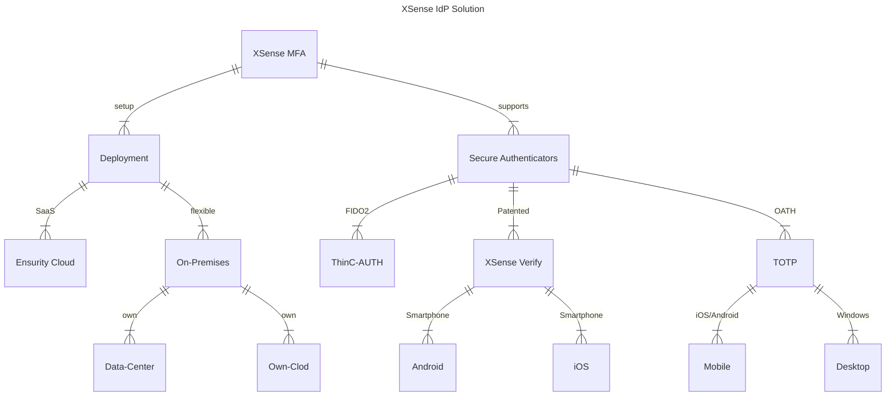

---

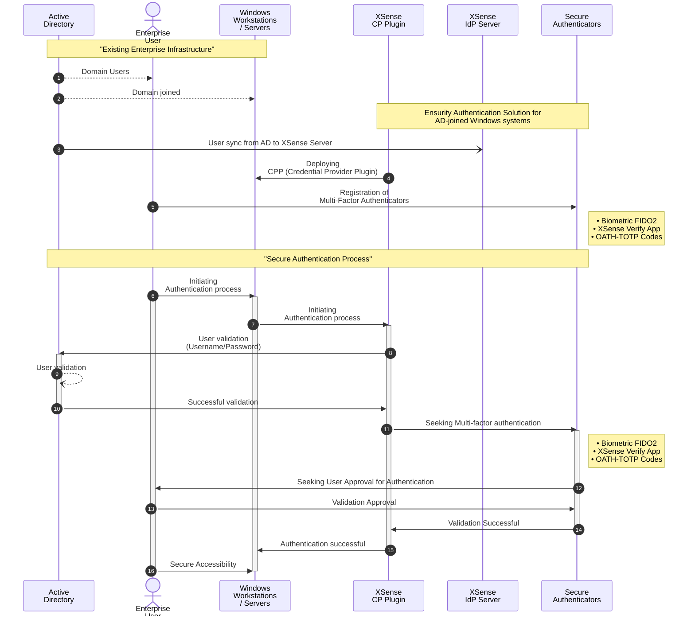

---

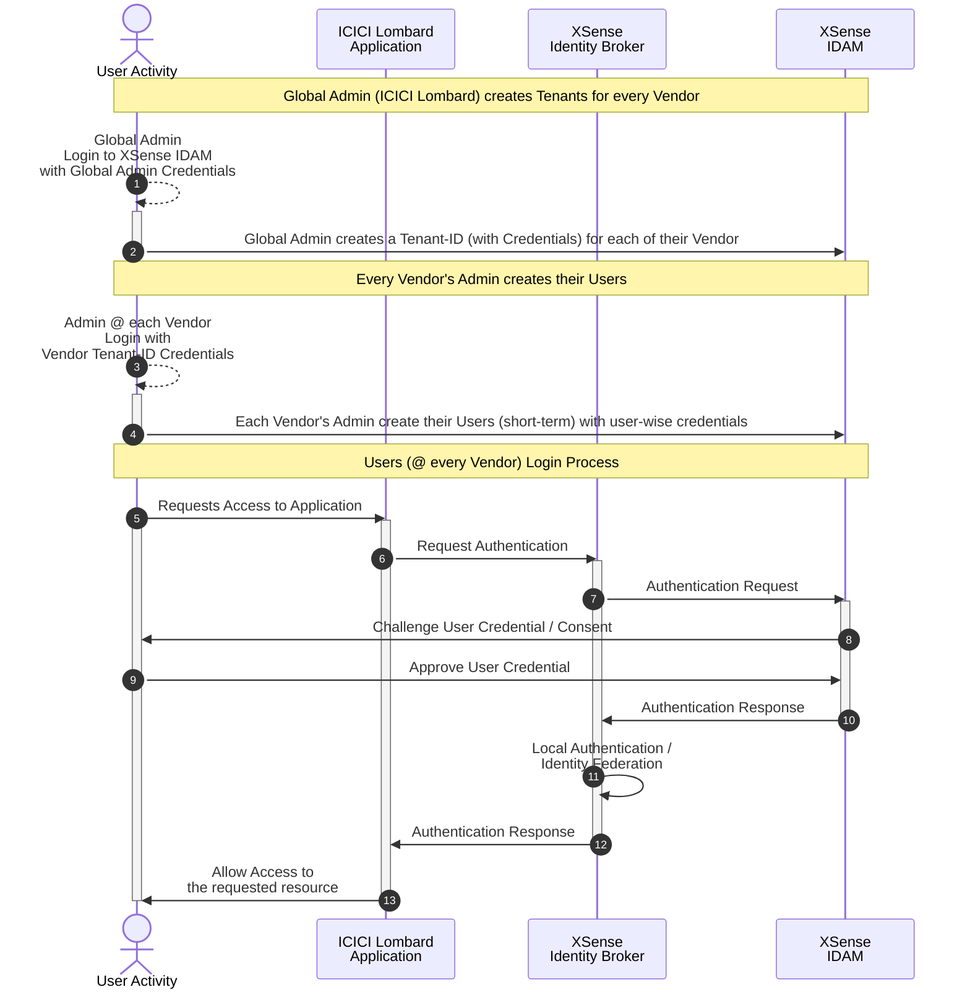

---

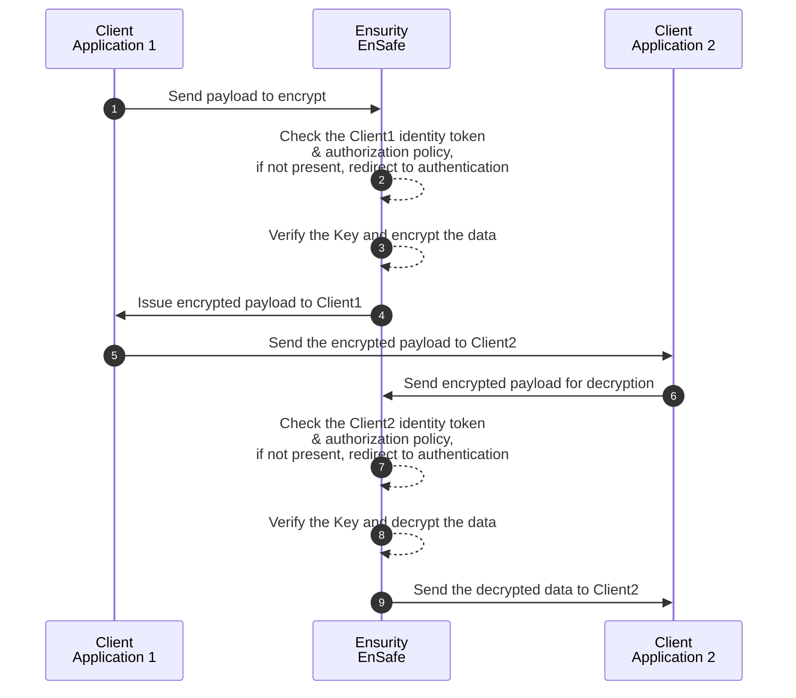

---

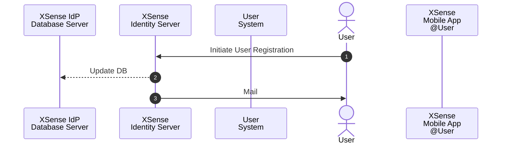

----

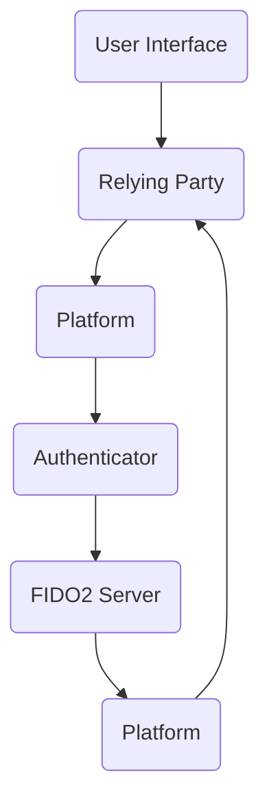

---

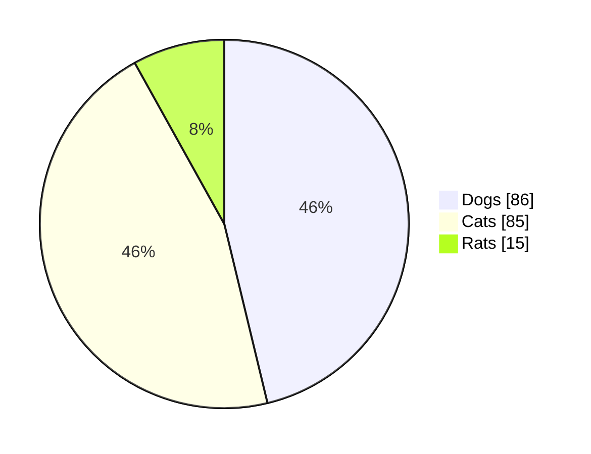
pie title Pets adopted by volunteers

---

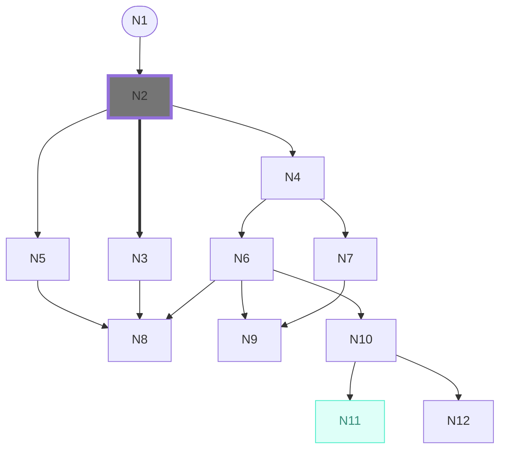

---

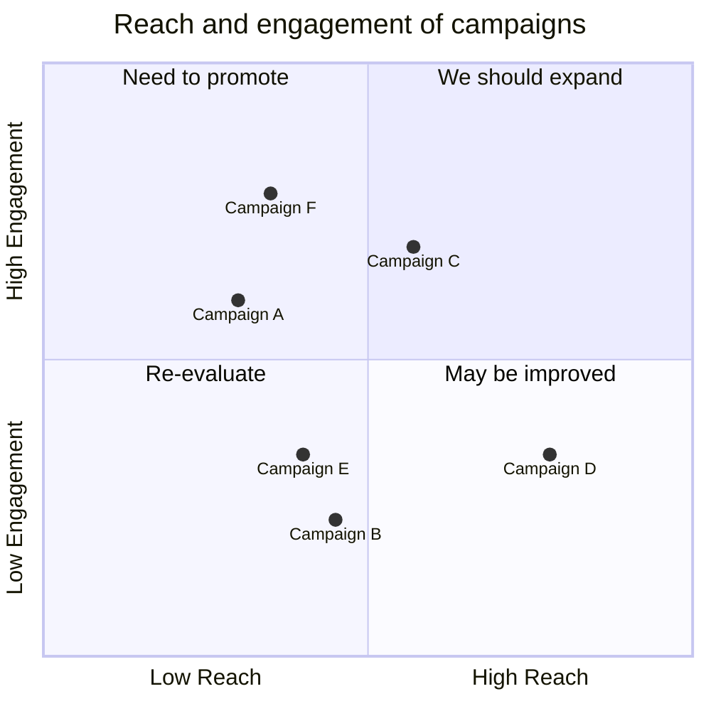

---

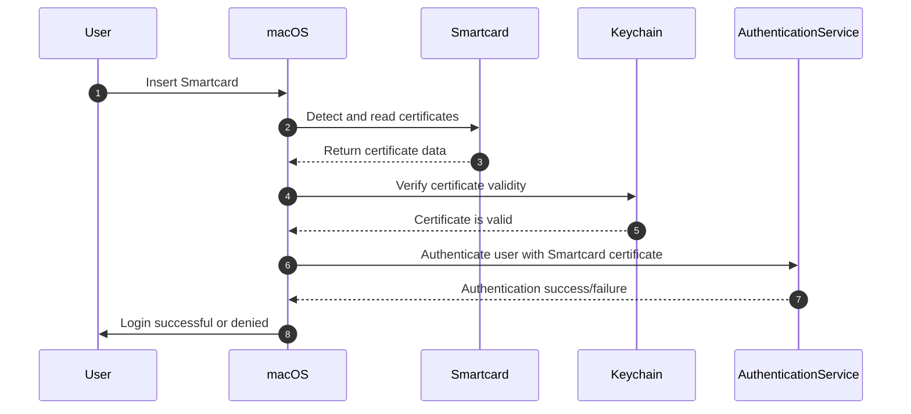

---

# FAQ for CPP

## How do i disable the "Other user" option when logging into Windows on a PC joined to AD?

To use a Group Policy Object (GPO) to disable the "Other Users" option in the Windows logon screen when the PC is joined to Active Directory, you can follow these steps:

- Open the Group Policy Management Console.
- Create a new Group Policy Object or select an existing Group Policy Object to edit.
- Right-click the selected GPO and select Edit to open the Group Policy Management Editor.
- Navigate to the following location in the editor: **`Computer Configuration > Policies > Windows Settings > Security Settings > Local Policies > Security Options`.**
- Find the policy setting called "**`Interactive logon: Do not display last user name`**" and double-click it.
- Select the Enabled option to prevent the last logged in user name from being displayed on the login screen.
- Click Apply, then OK to save your changes.

By enabling the "**`Interactive logon: Do not display last user name`**" policy, the "**`Other users`**" option on the Windows logon screen is disabled. This policy ensures that only the last logged-in user's username is displayed, preventing other users from entering their credentials directly on the login screen.

## 

---

<img alt="Ensurity Logo" src="data:image/png;base64,iVBORw0KGgoAAAANSUhEUgAAAKcAAAAeCAYAAABJ0w5RAAAACXBIWXMAACxLAAAsSwGlPZapAAAGlmlUWHRYTUw6Y29tLmFkb2JlLnhtcAAAAAAAPD94cGFja2V0IGJlZ2luPSLvu78iIGlkPSJXNU0wTXBDZWhpSHpyZVN6TlRjemtjOWQiPz4gPHg6eG1wbWV0YSB4bWxuczp4PSJhZG9iZTpuczptZXRhLyIgeDp4bXB0az0iQWRvYmUgWE1QIENvcmUgOS4xLWMwMDIgNzkuYTZhNjM5NjhhLCAyMDI0LzAzLzA2LTExOjUyOjA1ICAgICAgICAiPiA8cmRmOlJERiB4bWxuczpyZGY9Imh0dHA6Ly93d3cudzMub3JnLzE5OTkvMDIvMjItcmRmLXN5bnRheC1ucyMiPiA8cmRmOkRlc2NyaXB0aW9uIHJkZjphYm91dD0iIiB4bWxuczp4bXA9Imh0dHA6Ly9ucy5hZG9iZS5jb20veGFwLzEuMC8iIHhtbG5zOmRjPSJodHRwOi8vcHVybC5vcmcvZGMvZWxlbWVudHMvMS4xLyIgeG1sbnM6cGhvdG9zaG9wPSJodHRwOi8vbnMuYWRvYmUuY29tL3Bob3Rvc2hvcC8xLjAvIiB4bWxuczp4bXBNTT0iaHR0cDovL25zLmFkb2JlLmNvbS94YXAvMS4wL21tLyIgeG1sbnM6c3RFdnQ9Imh0dHA6Ly9ucy5hZG9iZS5jb20veGFwLzEuMC9zVHlwZS9SZXNvdXJjZUV2ZW50IyIgeG1wOkNyZWF0b3JUb29sPSJBZG9iZSBQaG90b3Nob3AgMjUuMTEgKE1hY2ludG9zaCkiIHhtcDpDcmVhdGVEYXRlPSIyMDI0LTA0LTAzVDEzOjMyOjUyKzA1OjMwIiB4bXA6TW9kaWZ5RGF0ZT0iMjAyNS0wMi0yMFQxMzoxMDowMCswNTozMCIgeG1wOk1ldGFkYXRhRGF0ZT0iMjAyNS0wMi0yMFQxMzoxMDowMCswNTozMCIgZGM6Zm9ybWF0PSJpbWFnZS9wbmciIHBob3Rvc2hvcDpDb2xvck1vZGU9IjMiIHhtcE1NOkluc3RhbmNlSUQ9InhtcC5paWQ6MzI1MzYzZTMtMThiNC00MmM4LWFjOWItYTBmYzE3NjA2Y2YzIiB4bXBNTTpEb2N1bWVudElEPSJ4bXAuZGlkOmJmOTlkZTRiLTBmODMtNDRlYi05MTU4LTIyMjFjNjM1MGViMSIgeG1wTU06T3JpZ2luYWxEb2N1bWVudElEPSJ4bXAuZGlkOmJmOTlkZTRiLTBmODMtNDRlYi05MTU4LTIyMjFjNjM1MGViMSI+IDx4bXBNTTpIaXN0b3J5PiA8cmRmOlNlcT4gPHJkZjpsaSBzdEV2dDphY3Rpb249ImNyZWF0ZWQiIHN0RXZ0Omluc3RhbmNlSUQ9InhtcC5paWQ6YmY5OWRlNGItMGY4My00NGViLTkxNTgtMjIyMWM2MzUwZWIxIiBzdEV2dDp3aGVuPSIyMDI0LTA0LTAzVDEzOjMyOjUyKzA1OjMwIiBzdEV2dDpzb2Z0d2FyZUFnZW50PSJBZG9iZSBQaG90b3Nob3AgMjUuMTEgKE1hY2ludG9zaCkiLz4gPHJkZjpsaSBzdEV2dDphY3Rpb249InNhdmVkIiBzdEV2dDppbnN0YW5jZUlEPSJ4bXAuaWlkOjM5MTg3YTZmLWNjNmItNGMzMi05NjQwLTNmZjg5ZjdiOThhYiIgc3RFdnQ6d2hlbj0iMjAyNS0wMi0yMFQxMzowMDo0NSswNTozMCIgc3RFdnQ6c29mdHdhcmVBZ2VudD0iQWRvYmUgUGhvdG9zaG9wIDI1LjExIChNYWNpbnRvc2gpIiBzdEV2dDpjaGFuZ2VkPSIvIi8+IDxyZGY6bGkgc3RFdnQ6YWN0aW9uPSJzYXZlZCIgc3RFdnQ6aW5zdGFuY2VJRD0ieG1wLmlpZDozMjUzNjNlMy0xOGI0LTQyYzgtYWM5Yi1hMGZjMTc2MDZjZjMiIHN0RXZ0OndoZW49IjIwMjUtMDItMjBUMTM6MTA6MDArMDU6MzAiIHN0RXZ0OnNvZnR3YXJlQWdlbnQ9IkFkb2JlIFBob3Rvc2hvcCAyNS4xMSAoTWFjaW50b3NoKSIgc3RFdnQ6Y2hhbmdlZD0iLyIvPiA8L3JkZjpTZXE+IDwveG1wTU06SGlzdG9yeT4gPC9yZGY6RGVzY3JpcHRpb24+IDwvcmRmOlJERj4gPC94OnhtcG1ldGE+IDw/eHBhY2tldCBlbmQ9InIiPz7zrBaSAAAIOklEQVR42u1cZ3BVRRQOCUVABDSAwQQDGAQBy2BBMYIgqIQyDDIiExuCMhQxIy1xQIpEEikJKuaJRMRGQEGGosHQBEXAKCUgKF0QBEWCNA0Qz85811l29u7uLeE9mffjG/Le27P37O63u6ddIpom9IkI47JCOUJLQh9CN0J1l/20Jcwm3BKssYQX8/JCRcJkwilCKbCC0NxBH00JbxH+IpzE5zA5w/CMiRwpeWwh1NbINiZkEQ5zcnsIN4bJGYZXXE/Ya0NOhhQbuVqEdMIRiczeMDnD8AN3E44pyDnVRu5lhUyYnGH4grqE3QqiPWcjl6UhZ+MwOcPwA6k2JFtPqGkjM1pBTkb2+qFOThaeqEaoAY+wLMMgkT73eRVCK50IPQg9Cd0JHQm343edTlGS7yMNdLWTjcJvfLvyku8iHcyb9Xca4VeQ6yxhAaGexKuvZHit1xWeEWkzJl6Xch7Xmf12jaqDOoTehBmEAsIGwneENYR5hHGE+wgVPBCHLUgb9DWHsByhj08JGYSHCVVd9n0r4XXC94RiycSfh41WSMgl9MLmE/th8cJNhC85FGAuntbo8CTaFQjyrL++XDs2znUYv9VmGXTrhDnoC288B/bjSMJdwnjvwN+x3OZjn68ktMN8s88DcJqyddypIOffhHy0W4a/vyB8Q1iNz0s55EP3tYSBinDXVMgvleBzwg+ETJlwDGEsQgrnFIozlGCQnQ12i7hzHoHsGc3k/EjoZ3DC8YRnZD+t0V2GXYQx3GnBMEnRPlOjy6sK2clcu8GKdvtAoAuS3xZzh0M3eNzJgg7MofmW8D733TQXc8Nv6lU4lXVt+0nmJN1A7jihvSjITsIil0pPM7zy2a7+0EX/KwkNDEg/w8PEW3iC6zND0W6cRp8xhsTu61JPNidXoI9Ewgl8vxqB9Dzu1njTcEw6nAPh+xu0ZYH8Ltxzkw0OvFIcdhfZnG2EzIIb5GkIGkfY6KF/drI1UfT/lA/EXC6YEhMUbcdqyKlyNjIE08GNrvmc7diK8KeibZbhiW6CFuhniUHbQ4Rows2aUJeFNNEhaqAJQzhBhs1CVcXCe+1/q8TAj0AO+WuN7BkQ/IBiBz8m9Hs5kjPb4xo8hH6ug9mla19oeCh9JPPWVVfhBTgpqbAhXtEodIwzxE3CHG6QK+n/Xo3MfJy6zNGLhzMxBMa7ZT+tlZz8oUzOJZy+Tsg5HpvzqMbmt0NHYd6P+7Cm68Rwl9W53SlyClelOOnMzlmoeNAUoX0Tm/SYaPjPg2mwU9OW6dVeeEayRuY1RdiiNbxEmfcdKuT8Bc7Zs4QRhO2EbVzVkRNyxuJqZhs1oHFIV2ATMCfoK2zgOyXm1HkPxDwkRB7+I6dqAgcrJr4HvHWZ3CohjvWiRjkWOmrIta9tcPXMFPTRORUlMCsmYlxJOEF1scRQIOdK2Gx83/EgRQ0X5OTxkkJmP7culQlVYJ7J5my8Tw7oReRcqPDK8kCSPNgDDB8TpiN2d15hF8ZwJ9NihWKLFEFdVcijSLgGOrvwOo8iZsdMjkYhSk5mJt1kEAVxS850TYYo3jCEx9bwAxfETFdliDb6aAta2IarwzoFdykclAc1gXQ7c+B34Xq5FledW53/wURVCTFyTjMkR1mQ02luPRpJBycOXUUVOfeWATlXcw9tDCLJ2h3QDJ7ZRJsVMbS2QvtePug+l/OAdeQcrVmsUT6QMyXI5HRalVRfcRiJYcF4XW59dxmQMyBkKH5TGMLNNZU2TshppQz/8Kj/qBAi55D/GTlbKQ4jCycQV9cWfhQq0lRzYXPOga0pw2zYou+g3SJ4v9ZDGgnV1TwOSwx9MZtU5GKANyAjss8wzSZiO5fCTNWEpyopcsifKGRHGpJzaBDJuU+T9BDRHDK6+X3etCpJFRIa4KLgQvTkgkFOC1cTOmCBp6OwYIdh2CMRfSRp8sxdbZ6dpIhmlApyoUrOnaiUN7U31xjMa46TkrlRmgR8V4OOmiG001Ly26UkZ03okaLIvdfCmNZpJrGDgd1rOWaDUZhSHqWFgzRx3a1CcUkon5zN4CTWgc6xEicmEjFqk1qA6k7IeZsmS8BsuzdQ1sVeE02AHcIm4xlc6ccklTbBIGdnLqZZAPuznk3fkzSe+z1c27EGnn4Rqn+24LOq/XhJWV4okrMEjksRsoI/4aW3RKGPKYaBdkf2q5Nc61mcBmw3HeQqYMSgbUyQyFnBxsZjRv0s2I7JCFznaFJu64XrLAbmgB/O4s8ogAkVck5wMYYkTn6gYZldkttK+BjseD8mPy1I5HzAQLcLhmMYJtGlk8s8tLjBu9gUNAeLnJkeCj9aG1ayjfD6mkYzQ09Lhz1CIPtSkLMyKvX92FxrFe/bPG5zY5jgJMyMiBAj5yAXY4lD2nS/QdsFfr1DlIA8t9uF3YCK7ChDcurinLGKE72YI2dFhLKKPRJzk0FBczsXmagdkkIVU3L6Feecooglb3MwlmK8hvy2QdstEjPP8wtu7VGWdtBAgcOIh/aUpP6siiQ7++6oTXkd/x8F2J3mpyWpzxaIbzpNLBxCKWC04cTVhA272WBx0hDSUvU3yDAeqsL9mlM9oJBtaXgKWk7SEYNw3AHN2np++7Ih3vUZipeSclH7mY3vuoN8kZqF7I/2KRxSEUdVxdGq4VRhNssLnOxwhG/iFCm0R+GJfoarugje5na89LYSY+mNG8PNBNaCoT8MTtZ7+Hc4bNTahv20RkA/FyQK4CaYL9RO6tKG2ZDLwt/ZiLTMxDqq5BMwjlmYlwBORx4B6Miu6nclbQIo/shBXYSnN2f/BRB6b8gecmFRAAAAAElFTkSuQmCC" />

---

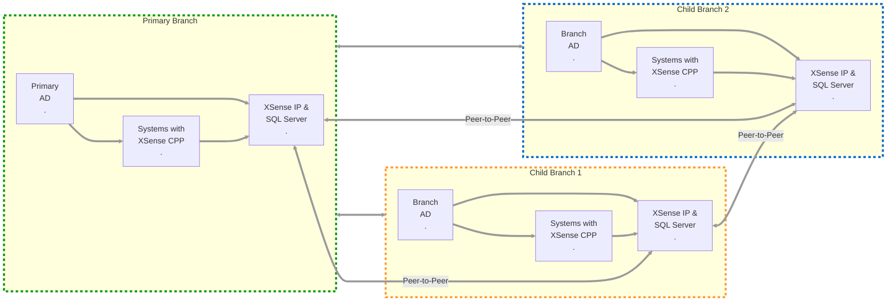

---

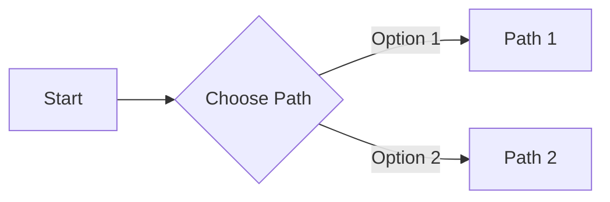

---

- What is PIV / Certificate-based Authentication?
  - Supported scenarios				
  - Unsupported scenarios				

- Pre-requisites for PIV	
  - Certificate Requirements and Enumeration
	 - Windows Server			
	   - CA Service for Domain Controller
	     - Generating a Certificate for AD User
	       - Configuration Parameters
		  - Export Public Certificate 
		  - Export Public+Private Certificate 
		  - Delete/Revoke Certificate	
		- Configure Systems to enable Smart-card login
	- Entra ID			

- Loading Certificate onto BioPro Key	

    
 
---

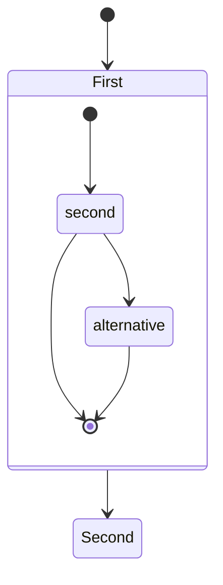

---

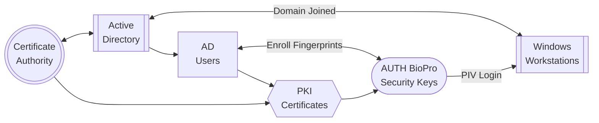

---

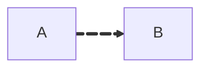

---

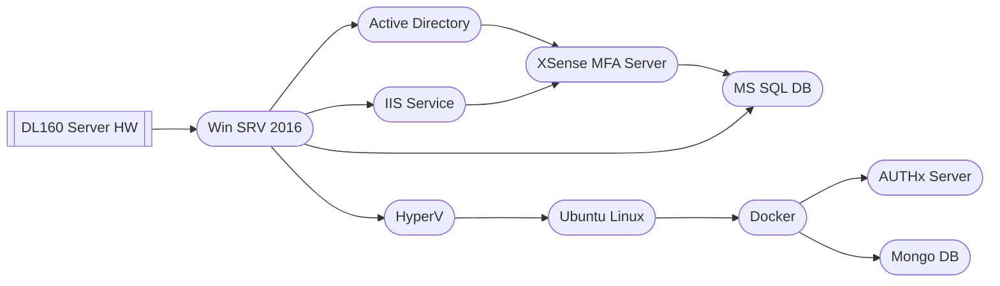

